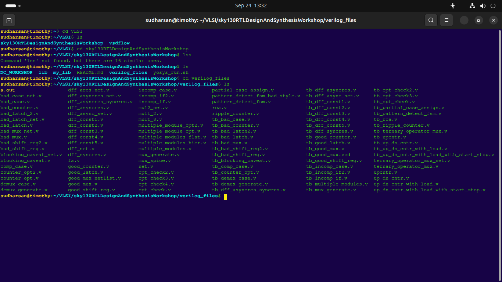
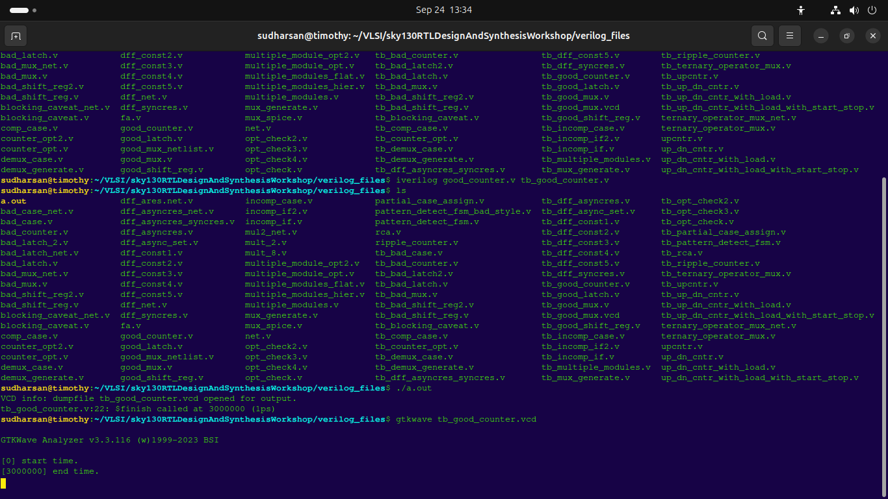
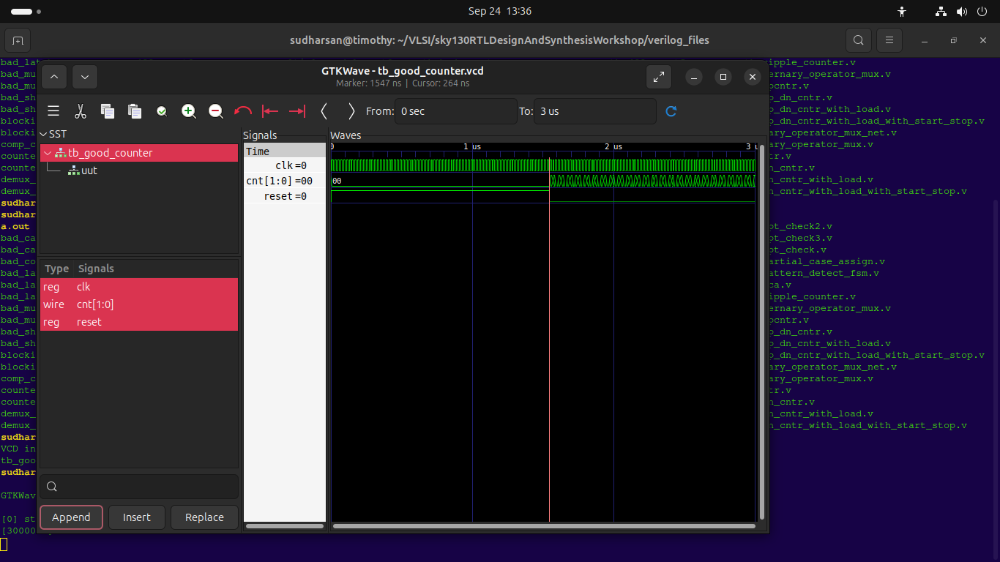

## DAY 1: Introduction to Icarus Verilog, GTKWave, Yosys & Sky130 PDK 
This is the follow up of my earlier repository about my journey in VSD workshop. This week i learnt the methods of using the different EDA tools that I downloaded the preceding week. 🎉  *Special thanks to [Kunal Ghosh](https://github.com/kunalg123/sky130RTLDesignAndSynthesisWorkshop) for the well structured repository* 

## PART 1:
We got hands-on with two essential open-source tools for Verilog simulation and waveform visualization:

- **Icarus Verilog (`iverilog`)** – A Verilog simulation  tool.
- **GTKWave** – A powerful waveform viewer for analyzing simulation results.

---

## What We Covered

✅ **Compiling Verilog code using `iverilog`**  
✅ **Running simulations and generating waveform dumps (`.vcd` files)**  
✅ **Viewing and analyzing waveforms in GTKWave**

---

## Quick Start Example

1. **Compile** your Verilog file:
   ```bash
   iverilog your_design.v testbench.v
   ```

2. **Run** the simulation:
   ```bash
   ./a.out
   ```

3. **Open** the waveform in GTKWave:
   ```bash
   gtkwave testbench.vcd
   ```

---

## Screenshots

Below are snapshots from our PART 1 session:

  
*This is the file path of my project*

  
*Compiling Verilog code with Icarus Verilog*

  
*Viewing simulation results in GTKWave*

---

## PART 2:
We got hands-on with two essential open-source tools for Verilog simulation and waveform visualization:

- **YOSYS** – A Verilog synthesis tool.
- **SKY130 LIB** – A versatile library with multiple modules.

---

## What We Covered

✅ **Synthesis of the RTL code and the .lib file**  
✅ **Generating the block diagram**  
✅ **Creating the NETLIST of the RTL code**

---

## Quick Start Example

1. **Read** your Verilog and .lib file:
   ```bash
   read_liberty -lib ../lib/sky130_fd_sc_hd__tt_025C_1v80.lib
   read_verilog your_design.v
   ```

2. **Synthesis** of the files:
   ```bash
   synth -top your_design
   abc -liberty ../lib/sky130_fd_sc_hd__tt_025C_1v80.lib 
   ```

3. **Showing** the block diagrams:
   ```bash
   show
   ```

4. **Netlist** in Verilog file form:
   ```bash
   write_verilog your_netlist.v #gives unfiltered code
   write_verilog -noattr your_netlist.v #gives the filtered code
   !gvim your_netlist.v
   ```
---

## Screenshots

Below are snapshots from our PART 2 session:

  
*This is the file path of my project*

  
*Compiling Verilog code with Icarus Verilog*

  
*Viewing simulation results in GTKWave*

