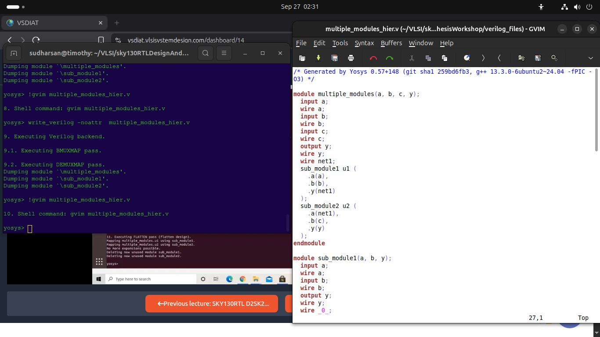
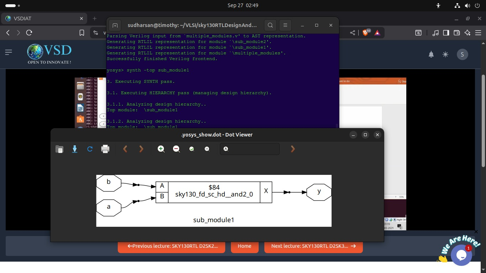
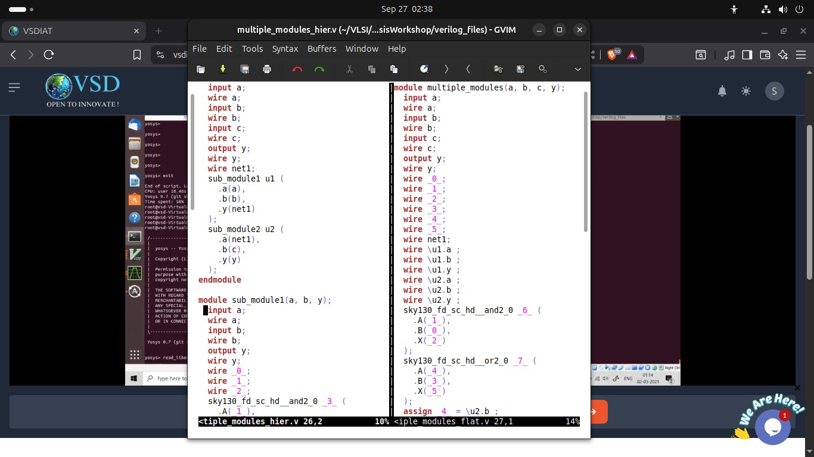
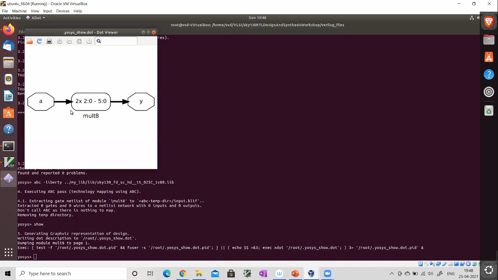

# 📚 Day 2: Understanding .lib Files, Hierarchical vs Flat Synthesis & Coding Style Optimizations #

> *“Synthesis is not just translation — it’s optimization guided by timing, area, and power.”*

This session dives into the foundational elements that drive synthesis decisions — from technology libraries (`.lib`) to design hierarchy and coding practices that influence synthesis results. You’ll learn how to interpret library data, control synthesis behavior, and write Verilog that synthesizes efficiently.

---

## 🎯 Session Objectives

By the end of this session, you will:
- Understand the structure and purpose of `.lib` (library) files.
- Learn how synthesis tools use `.lib` for timing and area estimation.
- Differentiate between **hierarchical** and **flat** synthesis flows.
- Identify how **coding style** affects synthesis output.
- Discover **interesting optimizations** performed automatically by synthesis tools.

---

## 📘 Part 1: Demystifying .lib Files

### What is a .lib File?
A **Liberty (.lib)** file contains:
- Cell definitions (AND, OR, FF, etc.)
- Timing arcs (setup, hold, propagation delays)
- Power consumption data
- Area information
- Pin capacitance, drive strength, etc.

These are used by synthesis tools (like Yosys/ABC) to map RTL logic to actual standard cells from a specific technology node (e.g., SkyWater 130nm).

### Example Command:
```bash
yosys> read_liberty ../my_lib/lib/sky130_fd_sc_hd__tt_025C_1v80.lib
```
➡️ This loads the library so synthesis can perform **technology mapping** using real cell characteristics.

> 💡 The `.lib` file is the bridge between abstract RTL and physical implementation.

---

## 🧱 Part 2: Hierarchical vs Flat Synthesis

### Hierarchical Synthesis
- Preserves module boundaries during synthesis.
- Useful for large designs, IP reuse, and team-based development.
- Each sub-module is synthesized independently.

#### Example: `multiple_modules.v`
```verilog
module multiple_modules(a, b, c, y);
    wire net1;
    sub_module1 u1 (.a(a), .b(b), .y(net1));
    sub_module2 u2 (.a(net1), .b(c), .y(y));
endmodule
```

✅ **Output**: Synthesis generates separate netlists for `sub_module1`, `sub_module2`, and top-level.

🖼️ **Image 1**: Shows hierarchical view in `.dot` format — `sub_module1` as a black box with internal AND gate.



> *Image 1: Hierarchical synthesis graph showing `sub_module1` as a black box with internal gate.*

---

### Flat Synthesis
- Merges all modules into a single flat netlist.
- Enables global optimizations across module boundaries.
- Often results in smaller area or better timing.

#### Command:
```bash
yosys> flatten
```
➡️ Deletes unused modules and flattens hierarchy.

🖼️ **Image 4**: After flattening, the design becomes one continuous netlist — no module boundaries remain.



> *Image 4: Flattened design graph — no module boundaries, fully optimized.*

---

## 🖥️ Part 3: Hands-On Comparison – Hierarchical vs Flat

### Image 2: Side-by-Side Code View
Left: Hierarchical code (`multiple_modules_hier.v`)  
Right: Flattened code (`multiple_modules_flat.v`)  
→ Shows how internal wires become explicit and modules are expanded.



> *Image 2: Side-by-side comparison of hierarchical vs flattened Verilog code.*

### Image 5: Writing Back Verilog
After synthesis, you can dump the netlist back to Verilog:
```bash
yosys> write_verilog -noattr multiple_modules_hier.v
```
➡️ Output shows mapped cells like `sky130_fd_sc_hd__and2_0` — confirming technology mapping occurred.


> *Image 5: Terminal showing `write_verilog` command and generated Verilog with mapped cells.*

---

## 🛠 Part 4: Coding Styles & Their Impact on Synthesis

### How Your Code Affects Output
Synthesis tools optimize based on:
- Signal assignments
- Module instantiations
- Combinational vs sequential logic structure

#### Example: Multiplier Block
🖼️ **Image 3**: Shows a block labeled `mult8` with input `a` → `2x 2:0 - 5:0` → output `y`.
➡️ This represents an 8-bit multiplier inferred from RTL — even if not explicitly instantiated!



> *Image 3: Synthesis inferred an 8-bit multiplier (`mult8`) from RTL description.*

> 💡 Synthesis tools can infer complex functions (adders, multipliers, FSMs) from simple RTL.

---

## 🌀 Part 5: Interesting Optimizations

### Optimization 1: Constant Propagation & Dead Code Elimination
If a signal is always constant or unused, synthesis removes it.

### Optimization 2: Gate-Level Merging
Multiple small gates may be merged into a single complex gate for area/timing efficiency.

### Optimization 3: Hierarchy Flattening for Global Optimization
As shown in Image 4 — flattening allows ABC to optimize across what were previously module boundaries.

---

## 📊 Key Takeaways

| Concept              | Key Insight                                                                 |
|----------------------|-----------------------------------------------------------------------------|
| `.lib` Files         | Define physical characteristics — essential for accurate synthesis.         |
| Hierarchical Flow    | Preserves modularity; good for large teams/IP reuse.                        |
| Flat Flow            | Enables global optimization; better for final area/timing closure.          |
| Coding Style         | Impacts how synthesis maps your design — avoid unnecessary complexity.      |
| Automatic Optimizations | Synthesis tools do smart things — understand them to write better RTL. |

---

## 💻 Tools & Commands Used

| Tool       | Purpose                                  |
|------------|------------------------------------------|
| **Yosys**  | Open-source synthesis tool               |
| **ABC**    | Technology mapper (part of Yosys flow)   |
| **GVIM**   | Editing Verilog files                    |
| **Dot Viewer** | Visualizing hierarchy/netlist graphs |

### Common Commands:
```bash
read_liberty <file.lib>
synth -top <module_name>
flatten
show
write_verilog -noattr <output.v>
```

---

## ✅ Best Practices

- Always load the correct `.lib` before synthesis.
- Use hierarchical design for modularity; flatten only when optimizing.
- Write clean, readable RTL — synthesis tools reward simplicity.
- Review synthesis reports and dot graphs to understand optimizations.

---

📌 *Continue to Day 3 for advanced topics like multicycle paths, false paths, and timing constraints.*

---

## 🖼️ Image Reference Table

| Image # | Description                             | Markdown Link |
|---------|-----------------------------------------|---------------|
| 1       | Hierarchical synthesis graph            | `` |
| 2       | Side-by-side code comparison            | `` |
| 3       | Inferred multiplier block               | `` |
| 4       | Flattened design graph                  | `` |
| 5       | Writing synthesized Verilog             | `` |

---
